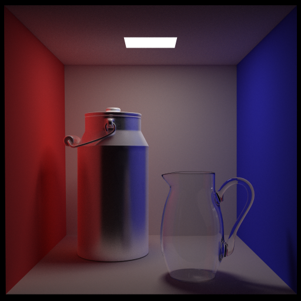
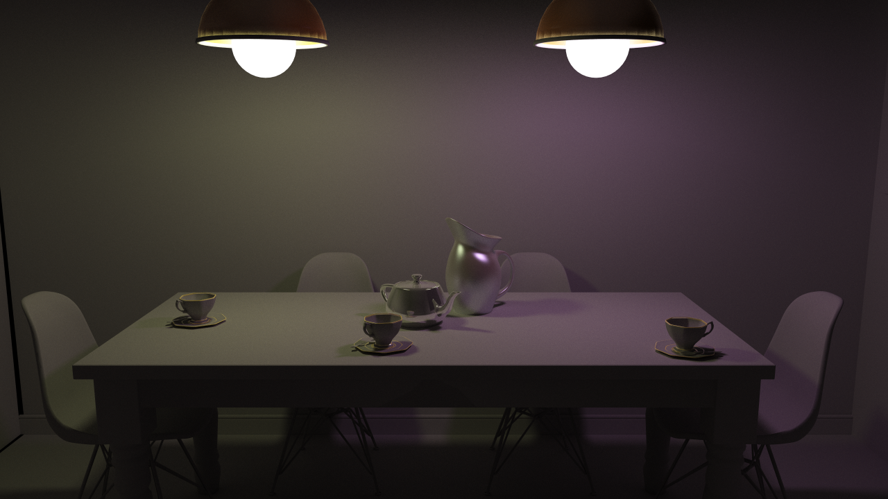
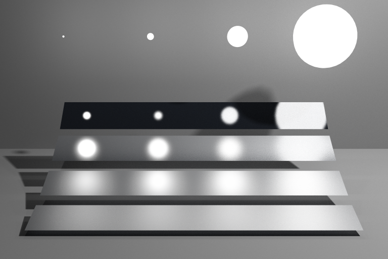
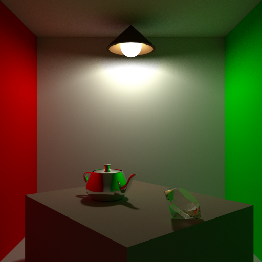

# CG-Ray-Tracer

A Basic Ray-Tracer implemented with C++.

Homework for Graduate Student Computer Graphics Course in ZJU.

## Results









## Features

* Monte-Carlo Path Tracing
    * Diffuse
    * Perfect & Imperfect(Glossy) Reflection
    * Reflection & Refraction
* Spatial Accelerating
    * KD-tree
* Direct Light Sampling
    * Rectangle Light
    * Sphere Light
* Camera
    * Perspective Camera

## System & Language & Tools

* CMake Project
* Development IDE: Clion
* Develop under MacOS 10.15
* C++14
* using libraries:
    * glm(header only, added in repo): https://github.com/g-truc/glm
    * tinyobjloader (header only, added in repo): https://github.com/tinyobjloader/tinyobjloader
    * OpenMP (on MacOS: `brew install libomp`): https://en.wikipedia.org/wiki/OpenMP

## Build & Run

Open with Clion, set working directory as project root directory, build and run~

Or:

```bash
cd cg-ray-tracer
cmake CMakeList.txt
make
./cg-ray-tracer
```

Config including model path, spp and recursive depth can be specified in `src/config.h`

